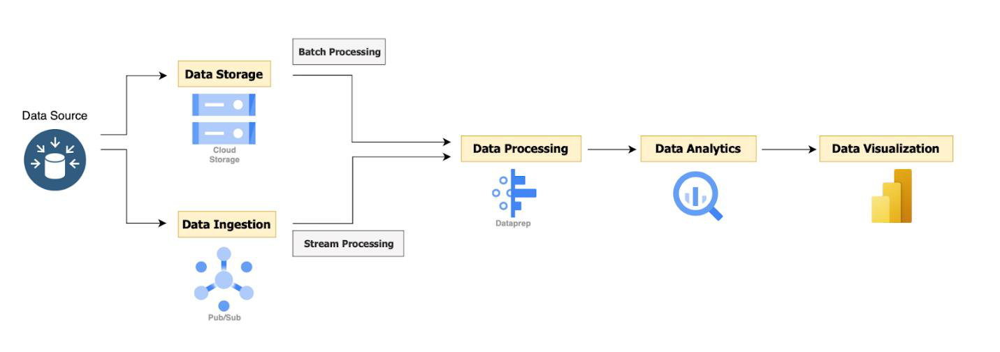
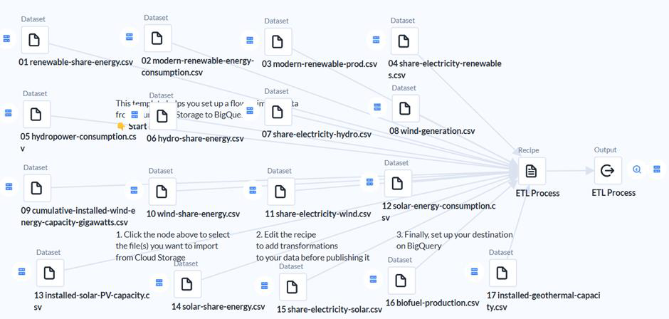
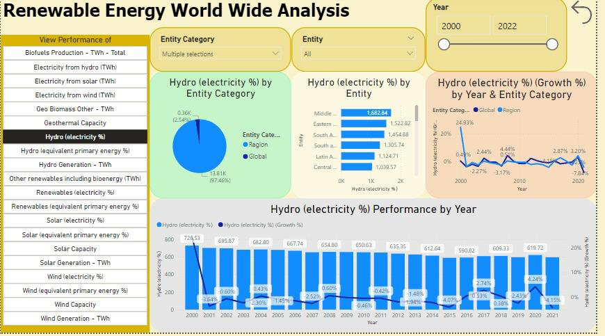
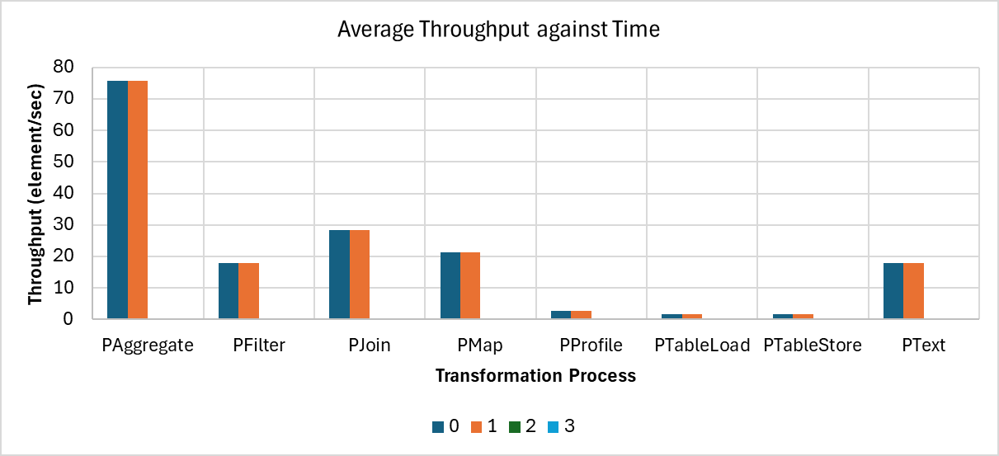
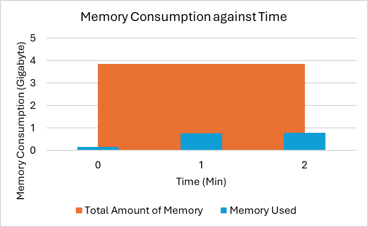

# Renewable Energy World Wide Analysis

**Course:** WQD7009 Big Data Applications and Analytics, Universiti Malaya (Semester 1, 2024/25)  
**Type:** Group project (team of 5)  
**Tools:** Google Cloud Storage · Pub/Sub · Cloud Dataprep · Dataflow · BigQuery · Power BI

## Problem

The world needs carbon-free energy infrastructure, but renewable technologies are spreading at very different speeds across regions. We built a cloud data pipeline and an interactive dashboard to answer three questions:

1. How do renewable energy technologies perform when compared across several dimensions (technology, region, year)?
2. What are the growth rates of renewable energy consumption globally and regionally over the last two decades?
3. Which renewable technology is growing fastest?

## Data

[Renewable Energy World Wide: 1965–2022](https://www.kaggle.com/datasets/belayethossainds/renewable-energy-world-wide-19652022) (Kaggle): 17 CSV files (2.61 MB) covering solar, wind, hydro, biofuel, geothermal and other renewables by country and region. The analysis focuses on **2000–2021**.

## Architecture

| Layer | Tool | Why it was chosen |
|---|---|---|
| Ingestion | Pub/Sub | Handles both real-time and batch ingestion and guarantees message delivery |
| Storage | Cloud Storage | Scalable, cost-tiered storage for structured and unstructured data, with native GCP integration |
| Processing | Dataprep (runs on Dataflow) | Visual, low-code cleaning with ML-suggested transformations |
| Analytics | BigQuery | Serverless SQL data warehouse for large-scale queries |
| Visualisation | Power BI | Interactive dashboards with a direct BigQuery connector |

## ETL pipeline (Dataprep → BigQuery)

1. **Integrate:** all 17 CSVs are loaded from the `renewable_energy` GCS bucket.
2. **Union and deduplicate:** the `Entity` and `Year` columns from every file are stacked into one base table of unique entity-year pairs.
3. **Left join:** each file's metrics are joined onto the base table, so no entity-year is lost when a file has gaps.
4. **Standardise column names:** for example, `Electricity from hydro (TWh)` becomes `Electricity_from_hydro_TWh`, so the names are valid in BigQuery.
5. **Enforce types:** year is cast to `INTEGER` and measures to `DECIMAL`, and invalid values are flagged.
6. **Load:** the result is written to a BigQuery table with autoscaling enabled.

## Dashboard

The report ([`renewable-energy-dashboard.pbix`](renewable-energy-dashboard.pbix)) has four pages: **Graphs**, **Wind**, **Electricity from Wind** and **Solar**. Each page has:

- a **field-parameter selector** to switch between about 20 renewable metrics (generation in TWh, share of electricity %, installed capacity, and so on)
- slicers for **Entity Category** (Region vs Global), **Entity** (country or region) and **Year range**
- breakdowns by category and entity, plus a year-by-year trend with a **year-on-year growth %** line

## Key findings

- **Solar is the fastest-growing technology.** Global solar generation rose **425%**, from 589.62 TWh in 2014 to **3,100.12 TWh** in 2021.
- Hydroelectricity is mature and stable. Its growth rate swings year to year, and the differences between regions are large.
- Regional contributions vary widely, so global totals hide very different adoption paths.

## Pipeline evaluation

The Dataflow job and the Power BI report were both profiled:

| Metric | Result |
|---|---|
| ETL duration | about 6 minutes end to end |
| Peak throughput | 75.85 elements/sec (aggregate transform) |
| Memory used | peak 790 MB of 3.85 GB allocated (20.5%) |
| CPU utilisation | 66.8% at start-up, settling to 32–41% |
| Power BI visual events | all under 300 ms on average |

## My contribution

_To be added._

## How to open

Open `renewable-energy-dashboard.pbix` in [Power BI Desktop](https://www.microsoft.com/power-platform/products/power-bi/desktop) (free, Windows). The data model is embedded, so no connection to the original BigQuery table is needed to explore the dashboard.
