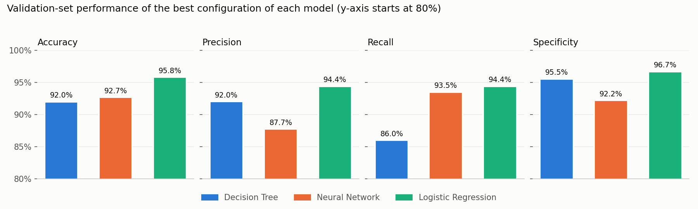
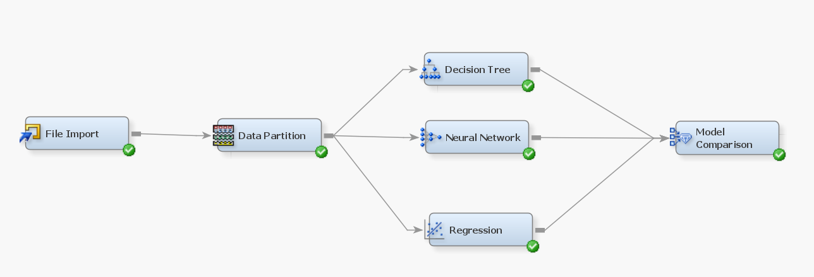
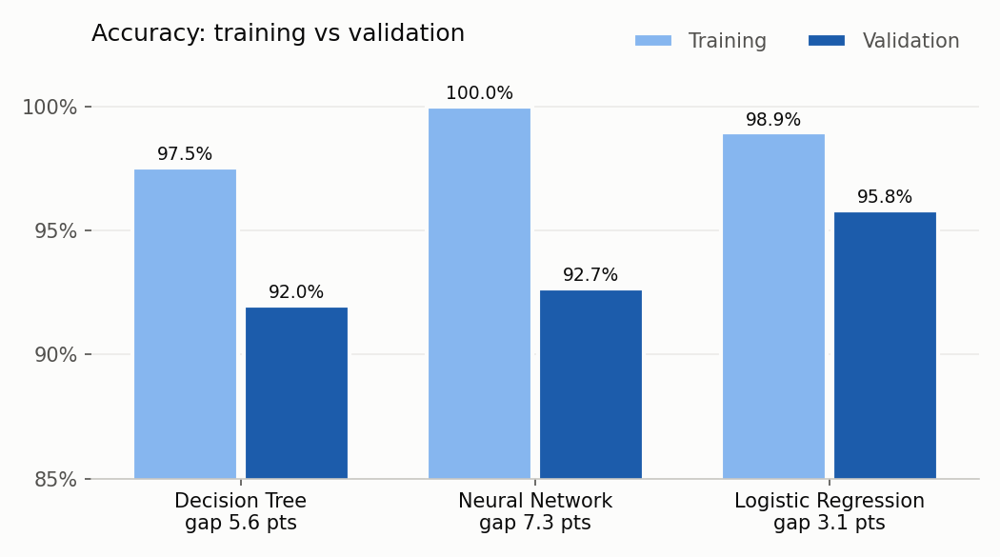

# Breast Cancer Diagnosis Classification (SAS Enterprise Miner)

**Course:** WQD7003 Introduction to Data Analytics, Universiti Malaya (Semester 1, 2024/25)  
**Type:** Individual assignment  
**Tools:** SAS Enterprise Miner

## Problem

Classify breast tumours as **malignant or benign** from 30 measurements of cell nuclei, and find which model family and tuning gives the most reliable results on unseen data.

## Data

`breast_data.csv`: the Wisconsin Diagnostic Breast Cancer dataset, with 569 samples. Each sample has 30 numeric features: the mean, standard error and "worst" values of radius, texture, perimeter, area, smoothness, compactness, concavity, concave points, symmetry and fractal dimension. The target is `diagnosis` (binary). The `id` column was dropped.

## Pipeline

**File Import → Data Partition (50% train / 50% validation) → three model families → Model Comparison**

13 configurations were tested:

| Model | Configurations | What was varied |
|---|---|---|
| Decision Tree | 3 | Maximum branch (2, 3, 4), leaf size (5, 10, 20), cross-validation on or off |
| Neural Network | 3 | Selection criterion (profit/loss, misclassification, average error), standardisation |
| Logistic Regression | 7 | Two-factor interactions on or off; selection method (none, stepwise, forward, backward); selection criterion |

## Results

Configuration of each model family compared in the report, on the **validation set**:

| Model | Accuracy | Precision | Recall | Specificity | ROC index |
|---|---|---|---|---|---|
| Decision Tree (Tree 1: max branch 2, leaf size 5) | 91.96% | 92.00% | 85.98% | 95.53% | 0.931 |
| Neural Network | 92.66% | 87.72% | 93.46% | 92.18% | 0.983 |
| **Logistic Regression (Reg 3: forward selection, main effects)** | **95.80%** | **94.39%** | **94.39%** | **96.65%** | **0.995** |

Across all seven Logistic Regression configurations, validation accuracy ranged from 91.96% to **96.15%** (Reg 2, 5, 6 and 7). Every configuration except Reg 1 (no variable selection) scored above 95%.

### Takeaways

- **Logistic Regression is the most reliable model.** It has the best validation accuracy, precision and specificity, and it generalised well, losing only 3.1 points of accuracy between training and validation.
- **The Neural Network overfits.** It scored 100% on every training metric but dropped 7.3 points on validation, and it has the lowest precision (more false positives).
- **The Decision Tree** is the easiest to interpret, but it misses the most malignant cases, with a recall of only 86%. That matters in a diagnostic setting, where a false negative is the costliest mistake.
- A simpler, regularised model can beat a more complex one when there are few samples (about 285 for training).

## Full report

[`sas-report-redacted.pdf`](sas-report-redacted.pdf) has the full write-up: variable roles, all 13 configurations, per-model charts (misclassification rate, ROC index, ASE, KS statistic, Gini coefficient) and the complete results appendix. Personal identifiers have been removed.
