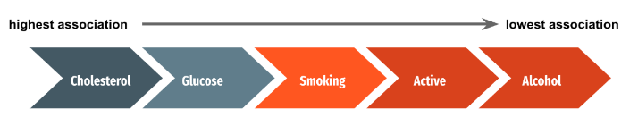
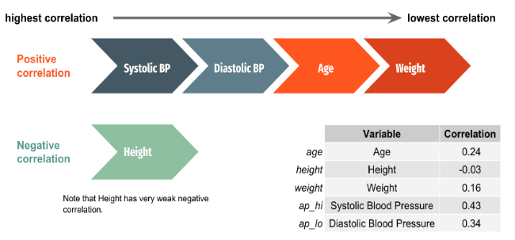
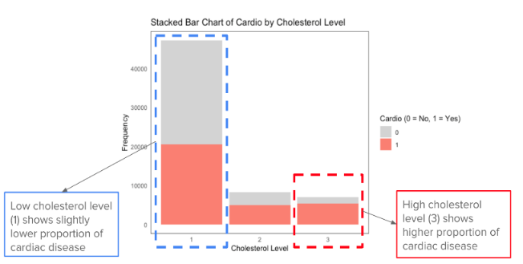
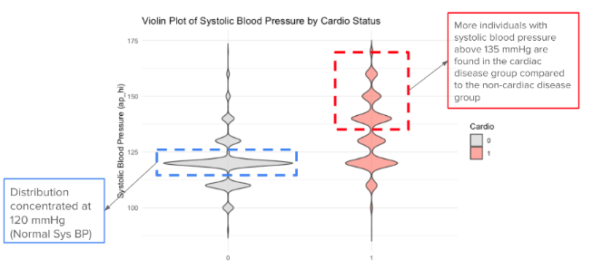
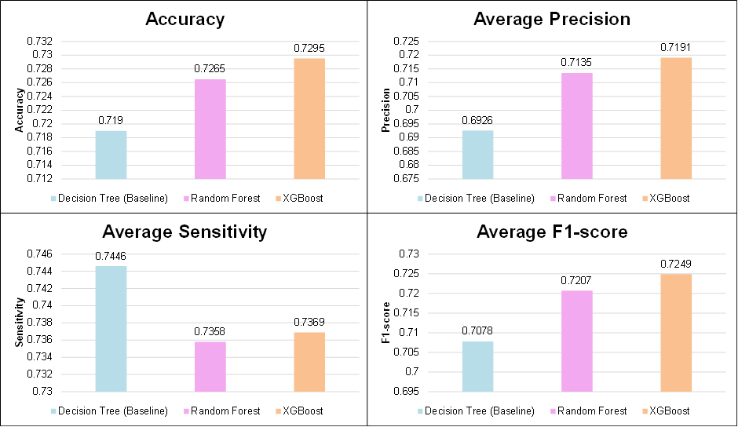
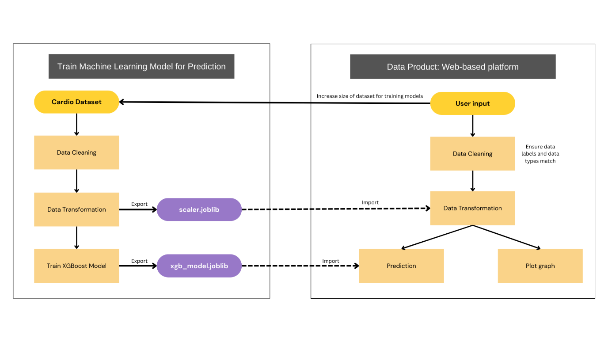
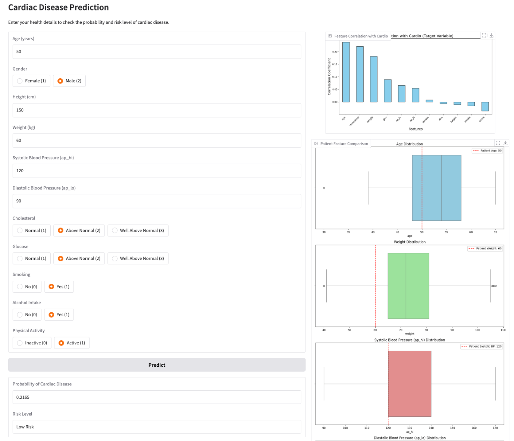

# Cardiovascular Disease Prediction

**Course:** WQD7001 Principles of Data Science, Universiti Malaya (Semester 1, 2024/25)  
**Type:** Group project (team of 5)  
**Tools:** Python (pandas, scikit-learn, XGBoost, matplotlib) · R (EDA)


## Business context

Ischaemic heart disease is the second leading cause of death in Malaysia (15% of medically certified deaths in 2023, DOSM). Insurance companies still assess applicant risk with slow, manual methods.

**Goal:** a model that predicts cardiovascular disease (CVD) risk when an applicant first applies for insurance. This lets the insurer price premiums correctly, fast-track low-risk applicants, and send only high-risk cases to a medical underwriter.

## Data

[Cardiovascular Disease dataset](https://www.kaggle.com/datasets/sulianova/cardiovascular-disease-dataset) (Kaggle): **70,000 patients**, 11 features plus a target.

| Feature | Type | Values |
|---|---|---|
| Age | Numeric | days (converted to years) |
| Height, Weight | Numeric | cm, kg |
| Gender | Categorical | 1 = female, 2 = male |
| Systolic BP (`ap_hi`), Diastolic BP (`ap_lo`) | Numeric | mmHg |
| Cholesterol, Glucose | Ordinal | 1 = normal, 2 = above normal, 3 = well above normal |
| Smoking, Alcohol, Physical activity | Binary | 0 / 1 |
| **Cardio (target)** | Binary | 0 = no CVD, 1 = CVD |

## Method (OSEMN)

**Scrub:** dropped the ID column, checked for missing values, converted age from days to years, removed outliers with the IQR method on age, height, weight and both blood pressures, and applied z-score scaling (the scaler is saved as `scaler.joblib` for deployment).

**Explore:**

| Qualitative variables: chi-square test | Quantitative variables: Pearson correlation |
|---|---|
|  |  |

- **Cholesterol** has the strongest association with CVD. Gender has no significant association (p = 0.23).
- **Systolic blood pressure** has the strongest correlation (r = 0.43), followed by diastolic BP, age and weight.

<p>


</p>

**Model:** Decision Tree (baseline), Random Forest and XGBoost were tuned with `GridSearchCV` and 5-fold cross-validation. Gradient Boosting and AdaBoost were also trained with default settings for comparison.

| Model | Best hyperparameters |
|---|---|
| Decision Tree | entropy, max depth 5, min samples split 2, min samples leaf 1 |
| Random Forest | 300 trees, max depth 10, min samples split 10, max features `sqrt` |
| XGBoost | 300 estimators, learning rate 0.01, max depth 5, subsample 0.8, colsample 0.8, gamma 0.2 |

## Results

| Model | Test accuracy | Precision (CVD) | Recall (CVD) | F1 (CVD) | ROC AUC* |
|---|---|---|---|---|---|
| Decision Tree (baseline) | 71.9% | 0.79 | 0.60 | 0.68 | 0.626 |
| Random Forest | 72.6% | 0.76 | 0.65 | 0.70 | 0.754 |
| **XGBoost** | **73.0%** | **0.76** | **0.66** | **0.71** | **0.782** |
| Gradient Boosting | 72.7% | 0.75 | 0.68 | 0.71 | – |
| AdaBoost | 72.1% | 0.76 | 0.63 | 0.69 | – |



**XGBoost was chosen for deployment.** It has the highest accuracy, F1 and AUC, so it balances false positives and false negatives best.

### Limitations and notes

- **The test sets differ.** The Decision Tree was tested on a 30% hold-out of the full dataset (21,000 rows). The other models were trained and tested on a 70/30 re-split of the cleaned training data (13,133 test rows). Their scores are close but not strictly comparable.
- *The ROC curves were computed with **default** hyperparameters, not the tuned ones. The untuned Decision Tree overfits, which explains its low AUC (0.626).
- An accuracy of about 73% is typical for this dataset, which contains only basic examination measurements. The model is meant to **triage** applicants for underwriter review, not to diagnose.

## Data product design

A web-based risk-screening tool for insurance agents:



1. The agent enters the applicant's details in a form. Radio buttons for categorical fields prevent invalid input.
2. The inputs are validated, scaled with `scaler.joblib`, and scored by `xgb_model.joblib`.
3. The tool shows the **probability of CVD** and a **High Risk / Low Risk** label.
4. A correlation chart shows which features drive risk. Box plots compare the applicant with the population.
5. New inputs are stored and periodically added to the training data so the model can be retrained.



## Business recommendations

- **Tailored plans:** offer high-risk applicants plans with wider heart-related coverage and preventive care.
- **Wellness programmes:** run smoking-cessation, exercise and diet programmes for flagged policyholders.
- **Automated approval:** add the model to the application platform so low-risk cases are approved automatically and high-risk ones are flagged at once.

## My contribution

_To be added._ (Team role: Secretary)

## How to run

```bash
pip install -r requirements.txt
# Download cardio_train.csv from Kaggle and place it in this folder
jupyter notebook cardio_models.ipynb
```

Run the cells in order, because the first cell creates the cleaned data and scaler that the later cells load. The XGBoost grid search (43,740 fits) takes a long time on a laptop.
