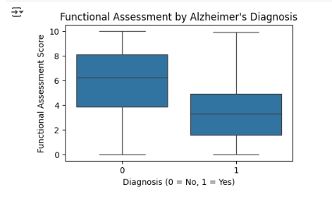
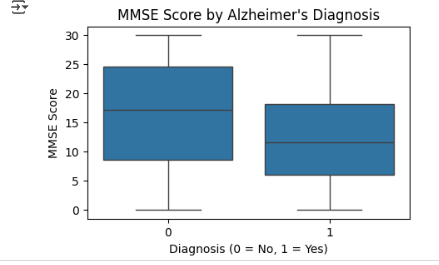
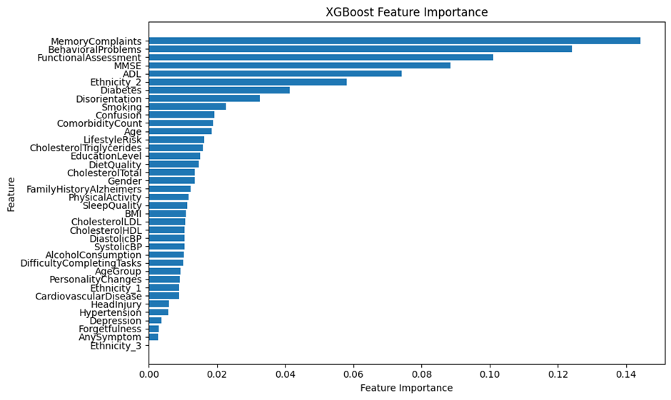
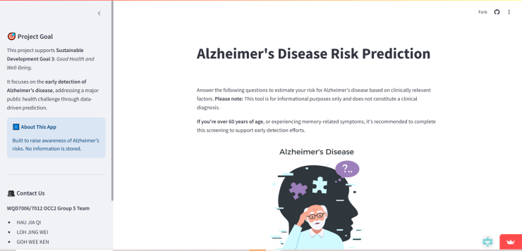

# Alzheimer's Disease Risk Prediction

**Course:** WQD7006/7012 Machine Learning for Data Science, Universiti Malaya (Semester 2, 2024/25)  
**Type:** Group project (team of 5), aligned with **SDG 3: Good Health and Well-Being**  
**Tools:** Python · pandas · scikit-learn · imbalanced-learn (SMOTE) · XGBoost · Streamlit

## Problem

Alzheimer's is usually diagnosed late, when cognitive decline is already severe. About 55 million people live with dementia worldwide, and there are 10 million new cases each year (WHO). The project aimed to:

1. Build ML models that predict Alzheimer's from demographic, lifestyle, medical and cognitive-assessment data
2. Compare model performance, with a focus on **recall** so that fewer true cases are missed
3. Deploy a web app where users enter basic information and receive a risk prediction

## Data

[Alzheimer's Disease Dataset](https://www.kaggle.com/datasets/rabieelkharoua/alzheimers-disease-dataset) (Kaggle): **2,149 patients** aged 60–90, 35 columns covering demographics, lifestyle (BMI, smoking, diet, sleep), medical history, clinical measurements (blood pressure, cholesterol), cognitive and functional assessments (MMSE, ADL, functional score) and symptoms. The classes are imbalanced: **35.4% diagnosed**.

## Method

**Preprocessing**
- Missing values were introduced on purpose and then imputed (mean or median for numeric features, mode for categorical ones) to practise imputation.
- `PatientID` and `DoctorInCharge` were dropped, and `Ethnicity` was one-hot encoded.
- **Feature engineering:** `AgeGroup`, `AnySymptom`, `ComorbidityCount` and a composite `LifestyleRisk` score were added.
- A stratified 70/30 split was used. Min–max scaling was fitted on the training set only.
- **SMOTE** was applied to the training set only, to balance the classes 1:1 without leaking into the test set.

**Exploratory findings**

| | |
|---|---|
|  |  |

- The features most correlated with diagnosis are **Functional Assessment, ADL, Memory Complaints, MMSE and Behavioural Problems**.
- Demographic and lifestyle factors show little difference between the groups.
- Risk rises with the number of comorbidities.

**Models:** each was trained with and without feature engineering.

| Model | Tuning |
|---|---|
| Decision Tree | GridSearchCV, 5-fold (depth, min samples split/leaf, criterion) |
| SVM | GridSearchCV (C, gamma, kernel) |
| XGBoost | Trained on all features, then on the top 10 by importance, then tuned with RandomizedSearchCV, 5-fold (depth, learning rate, subsample, number of trees) |

## Results

Best configuration of each model on the 30% test set:

| Model | Dataset | Accuracy | F1 | Recall |
|---|---|---|---|---|
| Decision Tree | No feature engineering | 93.80% | 93.82% | 92.54% |
| SVM (linear, C = 0.1) | With feature engineering | 82.64% | 78.12% | 87.72% |
| **XGBoost** (depth 6, learning rate 0.23, 287 trees) | With feature engineering | **93.82%** | **93.80%** | **92.54%** |

**XGBoost was chosen for deployment.** Its accuracy is almost the same as the Decision Tree's, but it gives:
- **SHAP explainability**, so each prediction can be explained feature by feature
- **More stable results** on new patients, because an ensemble is less sensitive to how the data was split
- **Scalability**, with parallel training suitable for production

## Deployment

A **Streamlit** app ([alzheimer-g5.streamlit.app](https://alzheimer-g5.streamlit.app/)) that:
- takes user inputs and returns a personalised risk probability
- suggests next steps for early detection or lifestyle changes
- shows the user's risk percentile compared with the dataset

> Free-tier Streamlit apps go to sleep when unused, so the first visit may take a minute to wake it up.

## Commercialisation

- **Freemium SaaS model:** a free tier for individuals, a professional tier for clinics and GPs, an enterprise tier or API for hospitals and public health agencies, and consulting.
- **Cost:** about **USD 3,250** to build (130 hours) and **USD 125–135 per month** to maintain on free-tier hosting.
- **Future work:** multimodal inputs (MRI, voice and clinical data) and explainable-AI review with clinicians.

## Files

| File | Contents |
|---|---|
| `alzheimer_exploration.ipynb` | EDA, Random Forest with SMOTE (92% accuracy, 85% recall on a 20% hold-out), and the XGBoost + SMOTE pipeline setup |
| `requirements.txt` | Python dependencies |

The final team pipeline (feature engineering, Decision Tree, SVM and tuned XGBoost) was built in a shared Google Colab notebook.

## My contribution

_To be added._
