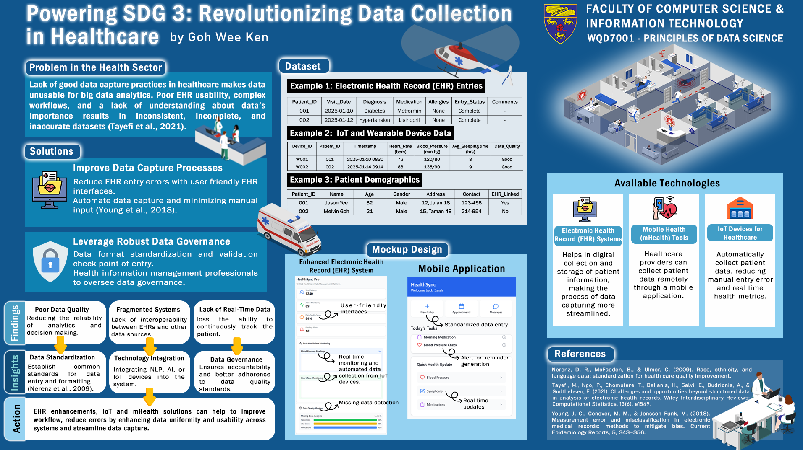

# Powering SDG 3: Revolutionising Data Collection in Healthcare

**Course:** WQD7001 Principles of Data Science, Universiti Malaya (Semester 1, 2024/25)  
**Type:** Individual academic poster  
**Format:** [High-resolution PDF](poster.pdf) · [PNG](poster.png)

## Problem

Poor data capture in healthcare makes data unusable for big data analytics. EHR systems that are hard to use, complex workflows, and a lack of understanding of why data matters lead to **inconsistent, incomplete and inaccurate datasets** (Tayefi et al., 2021).

## Proposed solutions

1. **Improve data capture:** reduce EHR entry errors with user-friendly interfaces, and automate capture to reduce manual input.
2. **Strong data governance:** standardise and validate data at the point of entry, with health information management professionals overseeing governance.

## Findings → insights → action

| Finding | Insight |
|---|---|
| Poor data quality makes analytics and decisions less reliable | **Data standardisation:** shared standards for data entry and formatting |
| Fragmented systems: EHRs and other sources don't work together | **Technology integration:** bring NLP, AI and IoT devices into one system |
| No real-time data, so patients can't be tracked continuously | **Data governance:** clear accountability and better adherence to data-quality standards |

**Action:** EHR improvements, IoT devices and mHealth tools together can improve workflow, reduce errors and make data capture faster and more consistent.

## What the poster includes

- **Example data schemas** for EHR entries, IoT and wearable device data, and patient demographics (all sample data), showing what well-structured healthcare records look like
- **Mock-ups** of an improved EHR dashboard (real-time monitoring, missing-data detection) and a mobile app (standardised entry, alert generation, real-time updates)
- **Technology overview:** EHR systems, mHealth tools and IoT devices for healthcare

## Skills demonstrated

Problem framing · data quality and governance · UX mock-up design · visual communication
