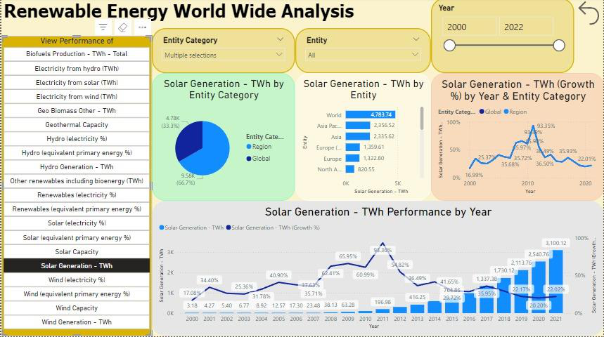
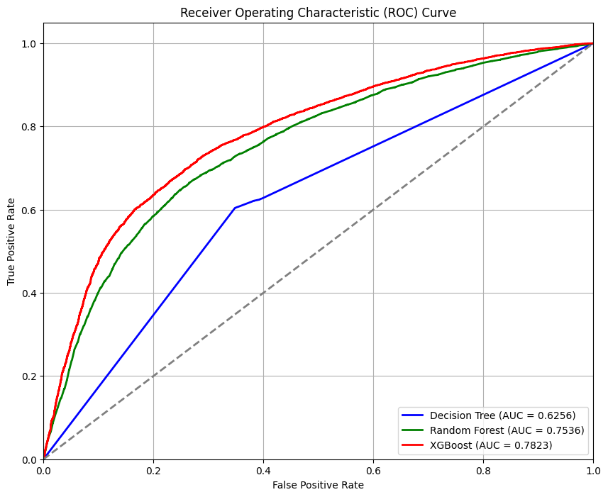
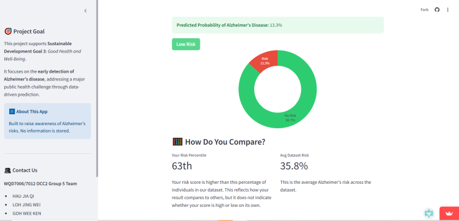
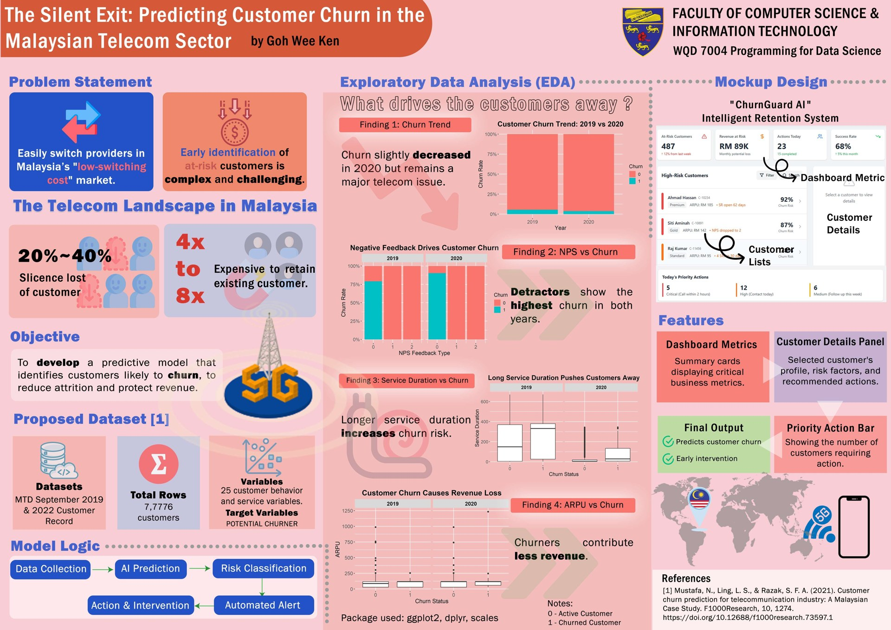

# Data Analytics Portfolio: Goh Wee Ken

Coursework projects from my data science studies at **Universiti Malaya** (Faculty of Computer Science & Information Technology), covering cloud data pipelines, business intelligence dashboards, machine learning in SAS and Python, big data strategy research, and science communication.

## Projects

| | Project | What it shows | Tools |
|---|---|---|---|
|  | **[Renewable Energy World Wide Analysis](01-renewable-energy-powerbi/)**<br>End-to-end cloud pipeline and interactive dashboard tracking the growth of solar, wind, hydro, biofuel and geothermal energy from 2000 to 2021. | Data engineering, ETL, BI dashboard design, pipeline performance evaluation | Google Cloud Storage, Pub/Sub, Dataprep, Dataflow, BigQuery, Power BI |
|  | **[Breast Cancer Diagnosis Classification](02-breast-cancer-sas/)**<br>13 tuned configurations of three model families compared for classifying tumours as malignant or benign. Logistic Regression reached 95.8% validation accuracy. | Supervised classification, hyperparameter tuning, model comparison, overfitting diagnosis | SAS Enterprise Miner |
|  | **[Cardiovascular Disease Prediction](03-cardiovascular-ml-python/)**<br>Risk-screening model for insurance applicants, trained on 70,000 patient records. XGBoost gave the best result (AUC 0.78), and the project includes a web-app design for deployment. | OSEMN workflow, EDA and statistical testing, ensemble models, GridSearchCV, data product design | Python, pandas, scikit-learn, XGBoost, R (EDA) |
|  | **[Alzheimer's Disease Risk Prediction](04-alzheimer-prediction-ml/)**<br>SDG 3 project: Decision Tree, SVM and XGBoost with SMOTE and feature engineering on 2,149 patients. XGBoost reached 93.8% accuracy and 92.5% recall, deployed as a Streamlit app with a commercialisation plan. | Class imbalance (SMOTE), feature engineering, model selection for recall, deployment, business case | Python, scikit-learn, imbalanced-learn, XGBoost, Streamlit |
| 📄 | **[Big Data Management at PayPal](05-paypal-big-data-case-study/)**<br>Research paper on how PayPal uses the 10 V's of big data, the six big data phases, and cloud migration to power fraud detection and strategy. | Big data architecture, data governance, technical research and writing | Hadoop, Spark, Aerospike, Google Cloud Dataflow (case study) |
|  | **[Powering SDG 3: Data Collection in Healthcare](06-poster-healthcare-data-collection/)**<br>Academic poster proposing better EHR design, IoT and mHealth tools, and data governance to fix poor-quality healthcare data. | Data quality, governance, UX mock-ups, visual communication | Poster design |
|  | **[The Silent Exit: Customer Churn in Malaysian Telecom](07-customer-churn-poster/)**<br>Academic poster on predicting telecom churn: EDA in R on NPS, service duration and revenue, plus a ChurnGuard AI retention dashboard mock-up. | EDA, churn problem framing, dashboard mock-up design | R (ggplot2, dplyr) |

## Skills demonstrated

- **Data engineering:** layered cloud architecture (ingestion → storage → processing → analytics → visualisation), multi-file joins and schema standardisation, BigQuery loading
- **Business intelligence:** interactive Power BI dashboards with slicers, field parameters and year-on-year growth measures
- **Machine learning:** Decision Trees, Random Forest, XGBoost, Gradient Boosting, AdaBoost, SVM, Neural Networks and Logistic Regression, with hyperparameter tuning, cross-validation, SMOTE and feature engineering
- **Deployment:** Streamlit web app, data product design, SaaS commercialisation and cost analysis
- **Evaluation:** accuracy, precision, recall, specificity, F1, ROC-AUC, KS statistic, Gini, and pipeline throughput, memory and CPU metrics
- **Communication:** turning model results into business recommendations for insurance, healthcare, energy and fintech stakeholders; research papers and academic posters

## Repository layout

```
01-renewable-energy-powerbi/   Power BI dashboard (.pbix), architecture and evaluation charts
02-breast-cancer-sas/          SAS pipeline, results charts, full report (PDF)
03-cardiovascular-ml-python/   Jupyter notebook, requirements, EDA and model charts
04-alzheimer-prediction-ml/    Exploratory notebook, EDA, results, Streamlit app screenshots
05-paypal-big-data-case-study/ Research paper summary
06-poster-healthcare-data-collection/  Academic poster (PNG)
07-customer-churn-poster/      Academic poster (PDF + JPG)
```

Each folder has its own README with the problem, method, results and my contribution.

> The datasets are public Kaggle datasets and are not stored in this repository. Each project README links to its source.
